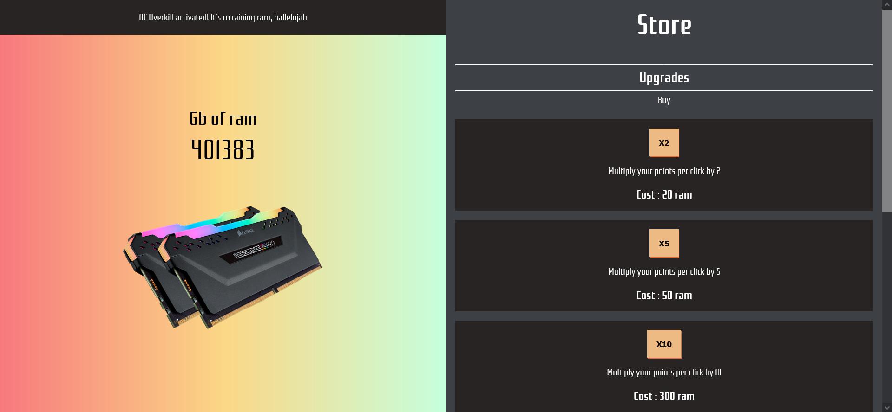

## Description

Création d'un clicker game: 
- HTML
- CSS
- JS
- Parcel

## Lien

[Github page](https://codekameleon.github.io/ram-clicker/)

## Rendu

## Perf lighthouse

## Credit 

- [Axel](https://github.com/codeKameleon)
- [Youssef](https://github.com/YoussefAkanni)
- [Dylan](https://github.com/Dyl-Richardson)
